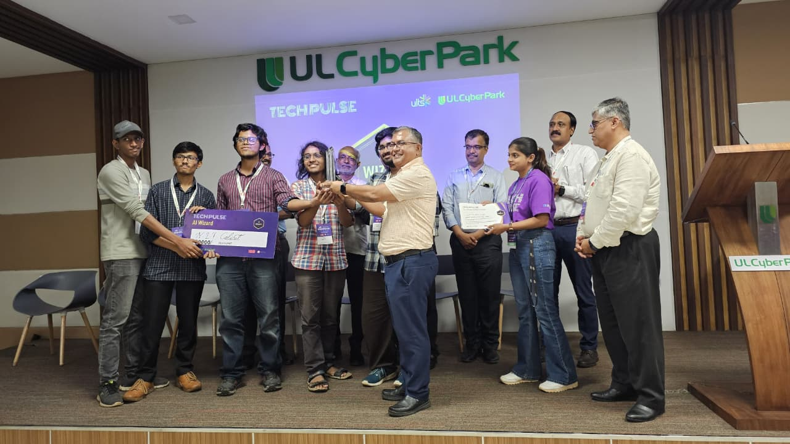
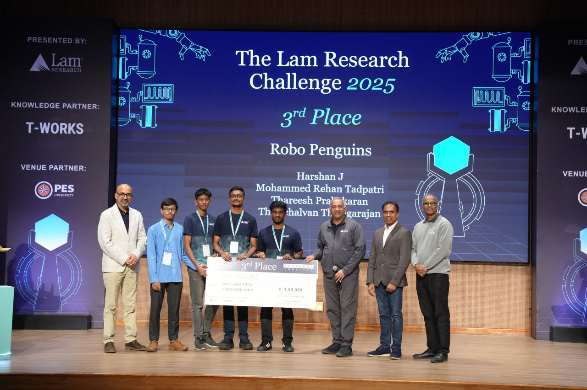

# Penguins

[About us](./about.md)

## Our History

- Code.INIT() 2025 at NIT Calicut - January 24-26, 2025

We established ourselves as the champions on the campus, by winning the annual hackathon, among 20+ teams. Our winning solution was [TuxCode](https://github.com/FlipperAI/Penguin-Dynamic-Docker) - a website where you can run code inside dynamically allocated docker containers in 15+ languages.

Participants -
1. Akhil T
2. Mohammed Rehan Tadpatri
3. Harshan J

- ULTS Tech Pulse at UL Cyber Park, Kozhikode - February 15-17, 2025

Now, we proceeded to prove ourselves on the state level - winning a hackathon amongst 800+ teams, and achieving the title of "AI Wizards". Our solution - [SiteSense](https://github.com/penguin-io/sitesense-backend) -  integrates RTSP camera streams and IoT-based location tracking, utilizing models like YOLO, Mediapipe, and DepthPro, alongside real-time transcoding via MediaMXNet and FFmpeg. We also constructed digital twins of work sites using Godot to enhance monitoring capabilities. The collected data was processed through condenser modules, a custom RAG system (Ollama + InfluxDB), and served via a FastAPI backend with a Next.js frontend, implementing RBAC for security.

Participants -
1. Jaefar Shameem
2. Vinit Keshri
3. Thiruchalvan Thiagirajan
4. Akhil T
5. Mohammed Rehan Tadptri

- Lam Research Challenge 2025 at PES Univerity, Bengaluru - December 11-12, 2025

By securing the third position, we now definitively prove the extent of our glory on the national level, by winning amongst 7000+ participants. Cool fact - we initially were rejected for the final round and were called in as a wild-card entry 3 days before the competition.

Participants -
1. Thiruchalvan Thiagirajan
2. Harshan J
3. Thareesh Prabhakaran
4. Mohammed Rehan Tadpatri
